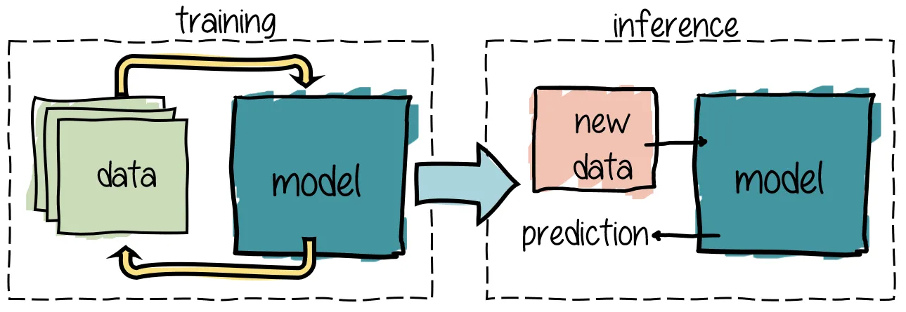
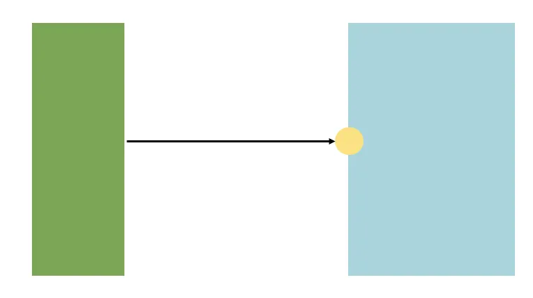
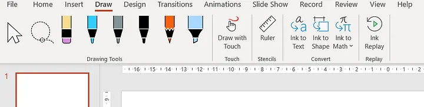
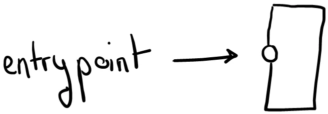

*TL;DR: I discovered the “draw” menu in PowerPoint, as it magically appeared when I plugged in my pen tablet. By combining it with the “sketch” shape outline, I made nice diagrams with a hand drawn feel.*

---

While preparing my talk for Snowcamp.io , I realized I needed to do many diagrams. “Many” being an understatement.

I started with the standard PowerPoint boxes:

However hard I tried, the diagrams turned out boring, and definitely not engaging. A quick search for ideas on Google led me to want to have “hand drawn” diagrams, or at least with this kind of feel. I was inspired by this blog post by Pascal Martin, but his method seemed tedious.

I happened to have an old pen tablet at home, the Wacom Bamboo Fun & Pen, probably not worth much today. I plugged it to try hand drawing some diagrams on Paint and other online tools, but it felt tiresome to get them back to PowerPoint, knowing that I’ll be needing to touch them up quite a few times as I was building my slide deck.

And then, a revelation: I noticed the “draw” menu that had appeared in PowerPoint. This menu includes a “Draw with Touch” option that handles the pressure of the pen of the tablet.

A quick Google search gives many examples on how to use these tool.

Back to my diagrams: I tried doing everything by hand, but either my hand was not precise enough or my tablet good enough (or both). This led to diagrams difficult to read. Writing text was out of the question: it gave a preschooler feel to the presentation — not what I was hoping for.

Instead, I went for a combination of:

- hand drawn shapes
- PowerPoint shapes with a sketched outline (Shape Format menu)
- and a font I downloaded

Once I had the hang of it, diagrams were a no-brainer. I could easily move objects around, change the weight outline of the shapes, etc. Even though the Powerpoint tool is very limited, editing the diagrams is so simple that I will not change my method any time soon.

The result is at the top of this post !

