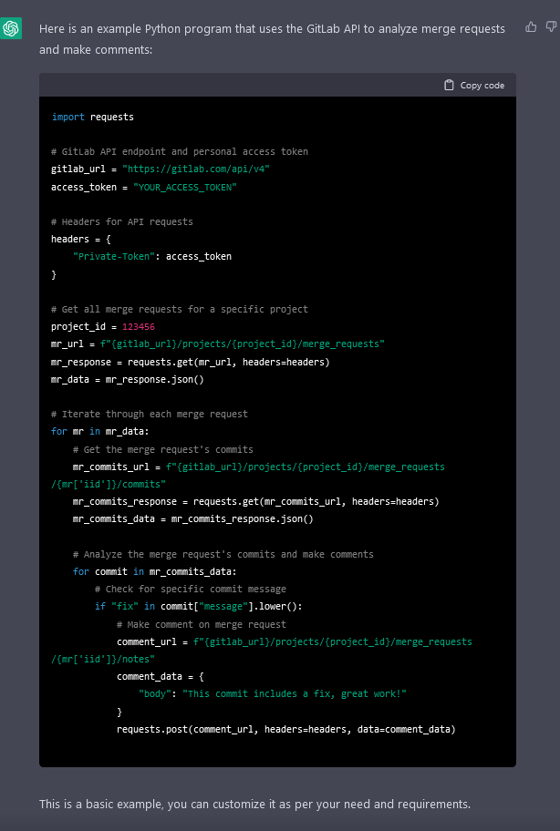
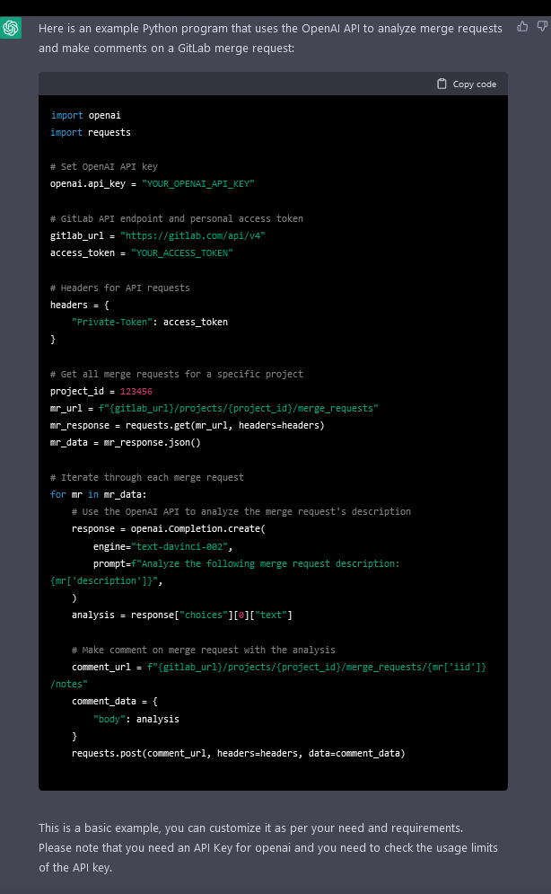
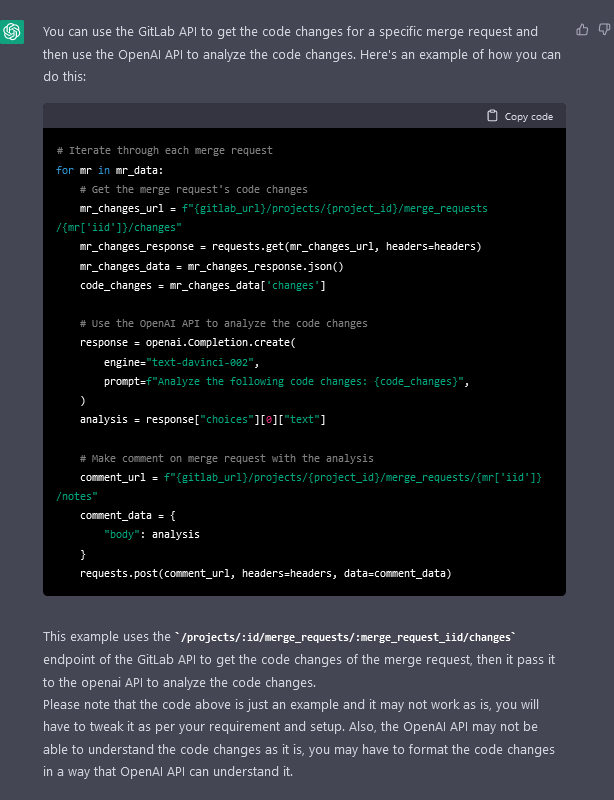
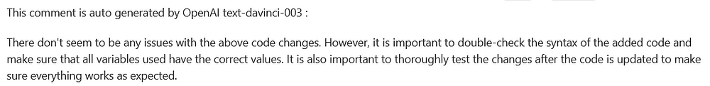

*TL;DR: I tried a merge request reviewer using OpenAI model with a simple prompt. The final code is available here: https://github.com/malywut/gpt_mr_reviewer*

---

I had an idea I wanted to try out with GPT3 : an automatic merge request review. Seemed simple enough, but I am not familiar with neither OpenAI APIs nor Gitlab’s APIs. I just need to go through both documentations… wait a minute. Isn’t that the perfect use case for ChatGPT ?

Let’s go!

## Using ChatGPT to generate a python script

Things started off wrong, I wrote “open” instead of “openai”. However, ChatGPT’s first answer is already useful.

Let’s correct my typo:

So, it’s seems I wasn’t precise enough. Here, the analysis is done on the description of the merge request. I’d rather have it on the changes.

This prompt is pretty bad, I am not sure I understand it myself. But ChatGPT seems fine with it, and gives me exactly what I am looking for:

You may have noticed that ChatGPT automatically used the OpenAI model text-davinci-002. We hit here one of the limitations : ChatGPT is not up-to-date, as the latest available model is text-davinci-003. Same for the APIs: if some changes were made after 2021, it would not have been taken into account in the code snippet generated by ChatGPT.

## Prompt tuning for generating review comments
Now that we have our Python script, let’s try it out!

ChatGPT warns here that the OpenAI api may not be able to understand code changes. I ran a couple of tests, and the results did seem satisfying, contrary to the warning. However, the answers were descriptive of the codes changes, rather than pointing out any issues.

At this point, the prompt for the OpenAI API was :

    Analyze the following code changes

I switched it to

    Analyze the following code changes and find issues that need fixing if any.

which gave results more like I was expecting… Until I noticed that it wasn’t really understanding the Git “diff” notation. For example, deleted lines were reviewed as being part of the final code.

    Analyze the following code changes and find issues that need fixing if any. 
    The code changes are in git diff notation,
    lines starting with - are deleted,
    lines starting with + are added

And… magic. This simple additional sentence changed everything.

If you want to check out the final (and very simple) python script : https://github.com/malywut/gpt_mr_reviewer


  A warning: this script uses the OpenAI API, which is not free. You have 18$ credit though, available for 3 months.


Let’s give text-davinci-003 the final word:

