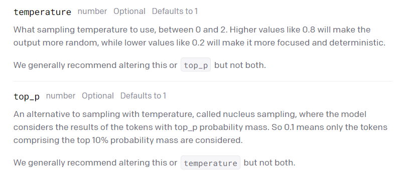
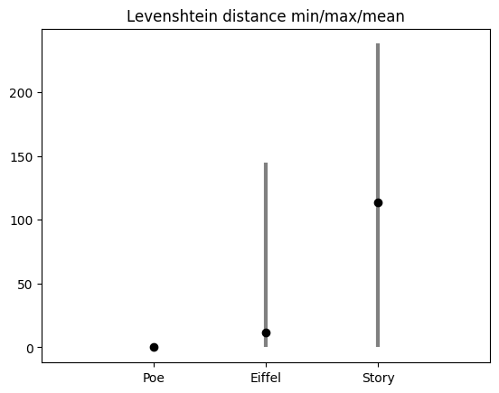
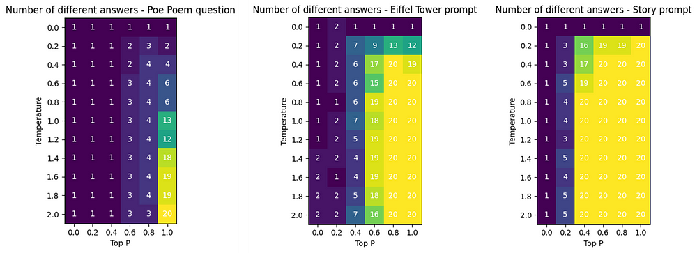
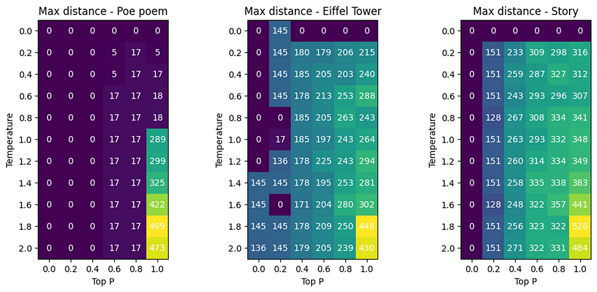

*TL;DR: While working with GPT-3.5 Turbo and GPT-4 models, I expected that the temperature parameter would allow the models to have a deterministic behavior. But very consistent is actually a better characterization. I ran some experiments to see how temperature and top_p parameters impact the models' output — in practice. My conclusion on this: when building LLM-powered apps, embrace the randomness!*

Want to learn more about using OpenAI models in your applications? Have a look at https://appswithgpt.com/!

## The starting point
OpenAI offers two options to adjust the randomness of the output: temperature, and top_p.

I have used the OpenAI API for multiple projects, and I usually only modified the temperature parameter. At first glance, it looks like GPT-3.5 Turbo can be made to be deterministic:

- With temperature = 0 and 50 runs, the prompt "List 5 animals" will always output
    
        1. Lion
        2. Elephant
        3. Dolphin
        4. Penguin
        5. Kangaroo

- With temperature = 1, I get some variants, such as:

        1. Lion
        2. Elephant
        3. Dolphin
        4. Penguin
        5. Turtle

- And with temperature = 2, I get complete gibberish:
        Sure! are you telling "list 5 famuan ideas .. here?" ┏((-_- ))┛ .. waiting..

        Would you like me to help execute gaming? talking your animous fans *O/* ? asda ★>
        include couple {its cool because do expert methods -> number_dumbledore_training=poleconnectpoint};
        ""T(O>P(&U56?> (@(?H1909 doesn'y comply zo*twell with page "".got -- ""(get_subeg `folder dogh)"

I am intrigued by "number_dumbledore_training" but that's not the subject here.
So, the temperature parameter seems a good way to play with the model's randomness. However, while working with LangChain, I found out that even with temperature = 0, the behavior of my application was not deterministic. Why? What was happening?
No, it's not an issue with LangChain. Yes, it's by design. My personal interest isn't so much on the why but the how: to build LLM-powered applications I need to know better how the models behave.

## Is GPT3.5-Turbo deterministic ?
According to the documentation, chat-based models have 2 parameters; temperature and top-p. To explore the subject I did a small experiment.
I chose three different prompts:
- *Give me the first stanza of The Raven by Poe*: I expect the answers to always be the same with a standard temperature and top_p
- *Tell me about the Eiffel Tower in 3 sentences*: I expect the answers to be similar with a standard temperature and top_p
- *Write a surprising story about a teapot and a fly, in 3 sentences*: I expect the answers to be very different with a standard temperature and top_p
All of these prompts should generate outputs of similar lengths, so comparing the results will make sense.
For exploration purposes, I can set the temperature to 0 and top_p to 0, and see what happens:
- Give me the first stanza of The Raven by Poe

        Once upon a midnight dreary, while I pondered, weak and weary,
        Over many a quaint and curious volume of forgotten lore - 
        While I nodded, nearly napping, suddenly there came a tapping,
        As of some one gently rapping, rapping at my chamber door.
        "'Tis some visitor," I muttered, "tapping at my chamber door - 
        Only this and nothing more."

- Tell me about the Eiffel Tower in 3 sentences

        The Eiffel Tower is an iconic landmark located in Paris, France.
        It was designed by Gustave Eiffel and completed in 1889 for the 
        Exposition Universelle (World's Fair). Standing at 330 meters tall,
        it was the tallest man-made structure in the world until 1930 and
        continues to be one of the most visited monuments globally.
- Write a surprising story about a teapot and a fly, in 3 sentences

        Once upon a time, in a quaint little kitchen, a teapot sat on the stove,
        longing for adventure. One day, a curious fly buzzed in through the window
        and landed on the teapot's spout, instantly forming a unique bond. Together,
        they embarked on a whimsical journey, exploring the world beyond the kitchen,
        and teaching everyone they encountered the true meaning of friendship.

Now, what if I run these queries 50 times each?

- Poe poem prompt: all 50 outputs are identical,
- Eiffel Tower prompt: 2 different answers,
- Story prompt: 4 different answers

These results demonstrate that GPT-3.5 Turbo is not deterministic, even with temperature=50 and top_p=0. However, the results are highly consistent. And my intuition was correct: the type of prompt does impact the consistency.
To dive deeper into what "highly consistent" means, I looked at the Levenshtein distance of the generated outputs. The idea is to measure how similar are the outputs: the distance value indicates the minimal number of deletions, insertions, or substitutions that are required to transform one string to another string.
In the following figure, I compared the 50 outputs to each other with the Levenshtein distance, and calculated the min,max and mean distance:

We can conclude that, in this experiment, not only are there more different answers for the "story" prompt but these answers are also more diverse.

## Exploring the impact of temperature and top_p parameters

I have read about how top_p and temperature work, but that is not enough from my engineering perspective: I need practice, not theory! I want to see, on real examples, how these parameters impact the outputs.
I ran a query with each of those prompts 20 times while changing the temperatures and top_p parameter incrementally, and I counted the number of different occurrences for each.

Once more, the results are very different from one prompt to the other. What we can see is that low top_p values limit the effectiveness of the temperature parameter.
Let's dive deeper once again with the Levenshtein distance:

As you can see, the results are also different for each prompts… except for the highest values: for all the prompts, temperature=2 and top_p=1 outputs complete giberrish. For reasonable values (for example temperature = 1 and top_p = 0.5) the outputs for the model have a higher distance for more creative prompts.

## How does that impact developing apps with OpenAI models?

Every software developer knows this: the worst kind of bug is the bug that appears randomly. When developing an application, we are used to wanting our code to behave deterministically - with reason. But if you are building an LLM-powered app… it looks like it isn't possible. How can this be handled?
My take: embrace the randomness!
Let me explain. LLM behavior is difficult to control. You might have spent days tailoring your prompts, but you will never be able to be 100% sure that your application will behave as expected. What can you do about this? Have a "retry" mechanism so that the user can repeat the action - and have a different output. And for that to work, you need to have a little randomness in the LLM behavior. I believe this to be a key point to have in mind when building LLM-powered solutions.

## Bonus: example values for top_p and temperature
For prompts where you need a precise answer, like the prompt to output the Poe poem: I recommend something close to temperature = 0.2, top_p = 0.1.
For prompts where you need specific content, but the formulation is not so important, like the Eiffel Tower prompt: I recommend something close to temperature = 1, top_p = 0.2.
For prompts where you need a creative output, like the story prompt: I recommend something close to temperature = 1.5, top_p = 1.