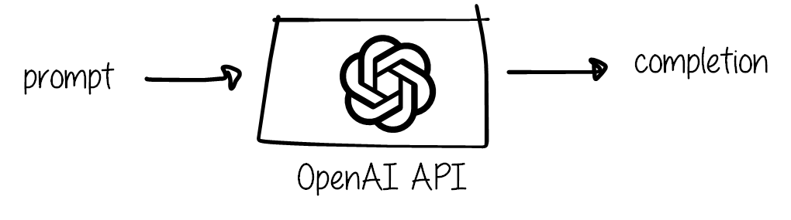
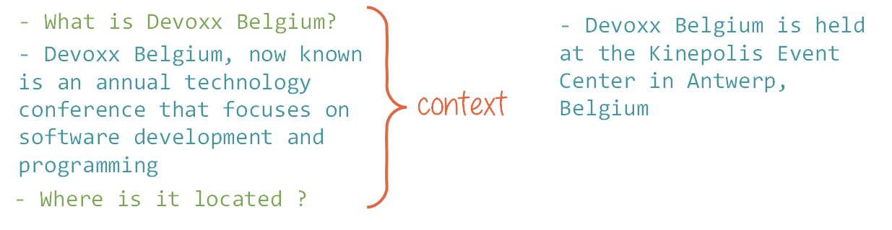
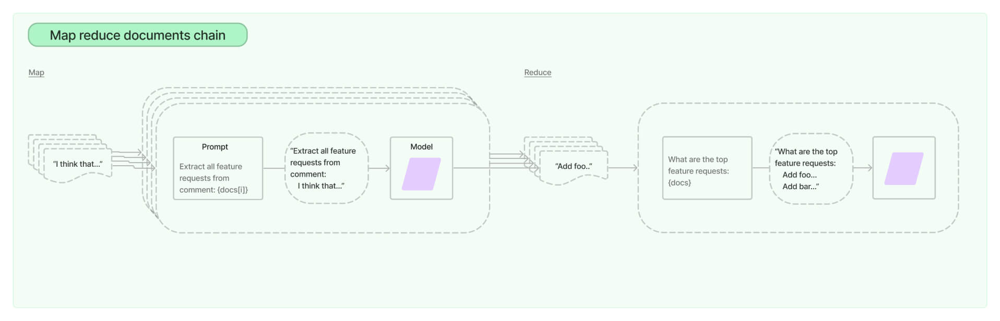
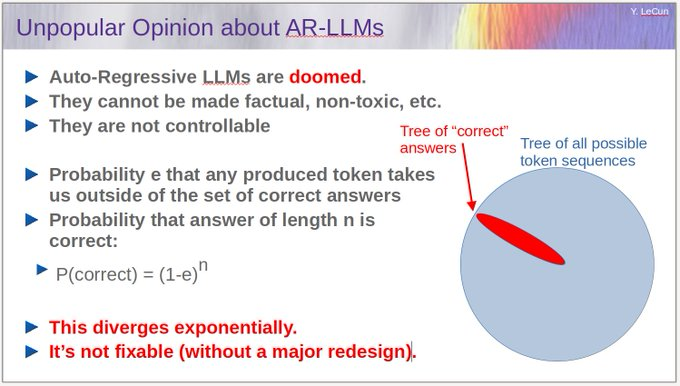
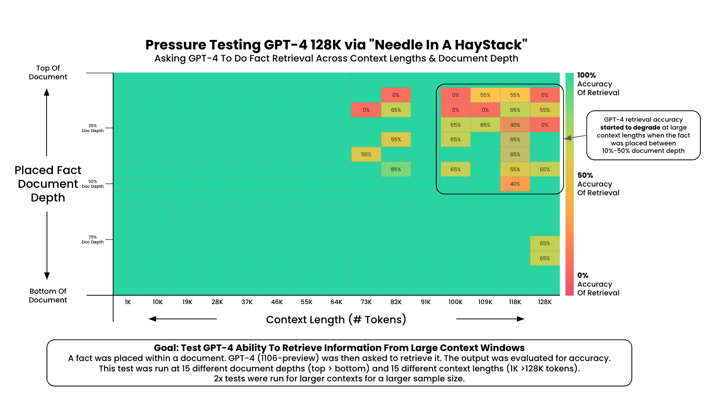
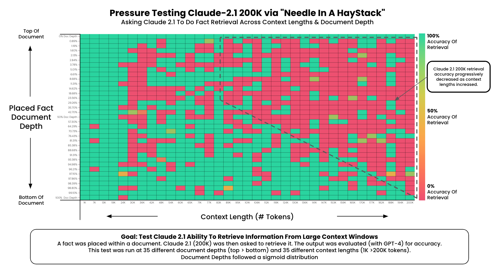

*TL;DR: In the wild world of LLM providers, there's this race going on about having the largest context possible. The big question: Is it a game-changer or just a money-making gimmick? Here's my two cents – it's pitched as a top-notch feature, but from where I stand, the reality might not match the hype.*

---

## Back to Basics
### What is "context"?

The context is the information that is given to the model for it to generate text. It can be a few words, a sentence, a paragraph, or even a whole book according to the model's capabilities. 

LLMs are stateless: they do not store the conversation with the user. In this case, "context" can refer to the list of messages exchanged between the user and the model.

Now, LLM providers have a tendency to brag about the length of the context they can handle, making context length a selling point. But is it really necessary, and does it work properly?

### What is the current status regarding context length?

As of today (December 2023):
- Claude 2.1 - 100k 
- GPT-4 Turbo - 128k
- GPT-4 - 16k or 32k
- GPT-3.5 - 16k
- Llama 2 - 4k
- Mistral - 8k

A 32k context is roughly equivalent to 50 pages of 500 words. Anthropic claims:
> The average person can read 100,000 tokens of text in ~5+ hours, and then they might need substantially longer to digest, remember, and analyze that information.
They were able to load The Great Gatsby (72k tokens) into Claude's context.

There is no doubt here: a 100k context - even a 32k context - is indeed huge.
The question is: is it useful? What can we do with it?

## The case for long context

### Complex instructions

The main argument for long context is that it allows the model to have a better understanding of the conversation. This is true, but only to a certain extent. From my experimentation with GPT-3.5 and GPT-4 models, I have found that the OpenAI models do not respond well to long and complicated prompts. For example, while working on the example of [this talk](), the models tended to forget part of the instructions: they would forget that they were supposed to answer in JSON format or ask the user for confirmation. These findings also led to the solution I suggest in this same talk or in [Developing Apps with GPT-4 and ChatGPT](), where I split the instructions into several prompts in a "state-machine" manner.
Additionally, anyone who has tried prompt engineering knows this feeling:

Prompt sensitivity is a real nightmare, and I can't fathom that anyone sound of mind would want to build and maintain a 16k prompt based on instructions.

So, for complex instructions, based on my empirical findings, a 16k context is more than enough.

### Document processing

The case that is often put forward for long context is document processing. For example, copy-pasting a document to ChatGPT and asking it to give a summary, translate it, extract key statements, etc. Two things come to mind with these use cases: is it efficient and is it reliable?

First of all, all of these tasks can be done by splitting the large input document into smaller chunks and combining the results. Of course, splitting the document randomly will not produce good results - chunks should better make sense as a whole, so a split by paragraph or section would be a good idea. So, **the context length is not a limitation** - as long as the document can be split properly.

In terms of efficiency, of course, a large context that can hold whole documents will be easier to use and set up as a solution. 
However, some tools and frameworks can help achieve a Map-Reduce workflow easily. For example, Langchain provides a [Map Reduce chain](https://python.langchain.com/docs/modules/chains/document/map_reduce). The documentation provides a clear example of how to use it to summarize a document. The same principle can be applied to other tasks.

*Langchain documentation*

Let's take the specific task of summarization. Would it be more efficient to use a large context to process the document in one go?

This [paper](https://arxiv.org/pdf/2310.19347.pdf) states that 
> Despite the recent progress in text summarization made by large language models (LLMs), they often generate summaries that are factually inconsistent with original articles, known as "hallucinations" in text generation. Unlike previous small models (e.g., BART, T5), current LLMs make fewer silly mistakes but more sophisticated ones, such as imposing cause and effect, adding false details, over-generalizing, etc. These hallucinations are challenging to detect through traditional methods [...]

*Introduction of Improving Factual Consistency of Text Summarization by Adversarially Decoupling Comprehension and Embellishment Abilities of LLMs by Feng et al.*

The authors provide methods to mitigate the risk of hallucination in the process of training models. For users like me who use closed models behind an API, these steps are not possible.
Empirically, I would rather trust the results of a summary generated by a map-reduce task than a 16k context summary. Of course, I have no evidence right now to back it up, but it is based on the fact that mathematically LLMs diverge exponentially.

*Yann LeCun on X, March 27th, 2023*

Very approximately, my intuition is based on the above explanation by Yann Lecun and that $ e^{a} + e^{b} $ grows slower than  $ e^{a}  e^{b} = e^{a + b} $ - the sum of the errors on part A and the errors on part B grows slower than the errors on part A and B combined.

So, document processing such as summary generation is possible without long contexts. However, if I am looking for reliability, I would rather consider a map-reduce approach. Of course, I would be happy to be challenged on this by an in-depth study, and this analysis might not stand over time as LLMs evolve and become more powerful. 

### Question answering

The other use case I have seen over and over on social media is Question Answering: feed your LLM a very large document, and *ta-da* you'll be able to find information in it without the hassle of reading it yourself.
Sounds magical, but is it really?
This [paper](https://arxiv.org/pdf/2307.03172.pdf) states in their conclusion that 
> language model performance degrades significantly when changing the position of relevant information, indicating that models struggle to robustly access and use information in long input contexts.
*Lost in the Middle: How Language Models Use Long Contexts, by Liyu et al.*

I have found another interesting experimentation by this [GitHub user](https://github.com/gkamradt). They have run a 'needle in a haystack' analysis to test in-context retrieval ability of long context LLMs. The tests are as follows: 

1. Place a random fact or statement (the 'needle') in the middle of a long context window (the 'haystack')
2. Ask the model to retrieve this statement
3. Iterate over various document depths (where the needle is placed) and context lengths to measure performance

The results on GPT-4 128K and Claude 2.1 100k are displayed here:

*Results from https://github.com/gkamradt/LLMTest_NeedleInAHaystack*

I am extremely pleasantly surprised by the results on GPT-4, and I thank the author for spending the $200 needed to do this.

However, like document processing, the context length is not a real technical limitation, and Retrieval Augmented Generation (RAG) already allowed developers to handle information retrieval on large documents. An RAG system needs to be built, of course, and it is not as straightforward as sending documentation "as is" to the LLM, but just like the Map-Reduce approach, tools and frameworks such as [LlamaIndex](https://www.llamaindex.ai/) make it easier to set up.
RAG provides several advantages over the "long context" approach:
- No limit to the context size
- Less data leak - only chunks of data are sent to the LLM
- Faster - once the document is embedded, vector queries are efficient, and the LLM only needs to process a small amount of data
- Cost-efficient - as before, the LLM only needs to process a small amount of data
- Traceable - the chunks of raw documents used to answer the question can be logged and used as a reference to check how the LLM answered the question. Whereas the large context approach is completely "black-box".
- Reliable - as the studies provided earlier state, smaller contexts reduce the risk of hallucination. The issue resides more in the information retrieval aspect, which the developer has control over.
But this is only useful if you expect to query your documents multiple times. For a one-time query, the long context approach does make sense.

So: question-answering can be done with long contexts using GPT-4 - to some extent. I would not user over 64k context though, and only with one-time queries, where I do not need to have a trace of the information retrieval process. However, a RAG system with GPT-4 would allow to retrieve many and large data-chunks, making it very efficient and reliable. 

## Conclusion

Is it genuinely beneficial to feed a whopping 32k tokens (or even an extravagant 100k) of context to a large language model, even if it's technically capable? Well, the answer depends on the task at hand, but in most cases, the likely verdict is a "probably no." from my point of view.

However, when you take a glance at the buzz on social media, it's hard to ignore.. In the realm of LLM-as-a-service providers, where the fascination with language models is akin to magic, the ability to process an entire book in one call seems to work its own spell... I see that as success great marketing tactic!

