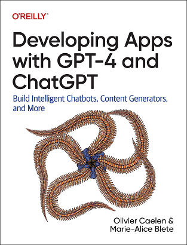
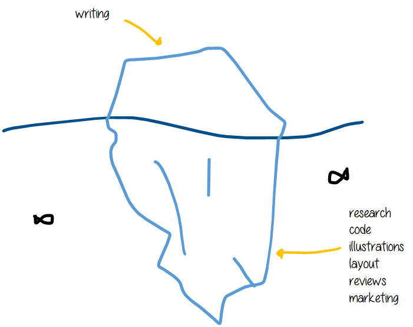
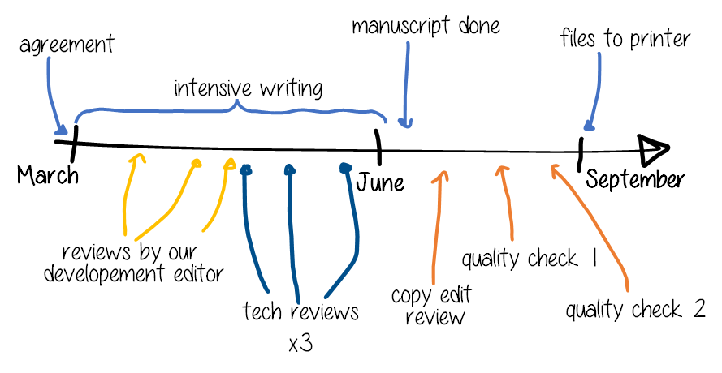
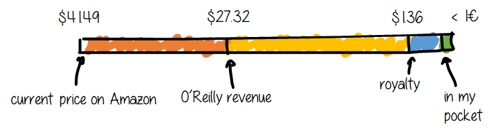

While researching information on writing a technical book, I found a blog post by Justin Garrison, titled [The economics of writing a technical book](https://rothgar.medium.com/the-economics-of-writing-a-technical-book-689d0c12fe39), written in 2018. I found this post to be a great read and would like in turn to share my own experience on the topic, update some of the information provided by Justin, and add some insights on the aspect of being a non-American writer.

I have been asked multiple times about the process, the time it took, the financial compensation, and more. I will try to answer these questions in this post.

My introduction will be exactly like Justin's: I am not an expert on the subject. I have co-authored with Olivier Caelen one book in two editions in 2023 and 2024, [Developing Apps with GPT-4 and ChatGPT](https://appswithgpt.com/), published by O'Reilly. This post will be *my* experience which might not apply to you - but I hope it will help you in some way.

To give you some context which might explain some specificities of my experience, I am French, and I am a software engineer. I have worked in a team specializing in AI for some years now. I also have some experience as a speaker at [tech conferences](https://mariealiceblete.com/talks/). Olivier, my co-author is Belgian. He is a researcher in AI, has published several papers, and teaches courses on the subject.

## The process

### The book proposal
O'Reilly has a [page to submit a book proposal](https://www.oreilly.com/work-with-us.html) or training courses, and everyone is free to submit their idea.

My experience was a little different: Olivier wrote a [great article](https://medium.com/towards-data-science/unleashing-the-power-of-gpt-how-to-fine-tune-your-model-da35c90766c4) for Towards Data Science, which was noticed by O'Reilly. They contacted him to collaborate, and agreed on a book. Olivier then asked me to co-author the book with him, and we wrote a proposal together.

A book proposal includes different sections, such as:
- the title (we worked together with O'Reilly to find the best title)
- a little market study:  who is the intended audience, are there any similar books on the market, what gap would it fill?
- a detailed table of contents with a short description of each chapter (we actually didn't follow this to the letter in the end)
- the estimated length of the book

Once the proposal is accepted, both parties sign an agreement, and the writing can start.

### The writing
Once the agreement was signed, I felt that writing the book itself came smoothly. Our outline was detailed, I knew what I had to write, and I had a clear idea of the content. Olivier and I have different backgrounds and expertise, and the splitting was easy: I would write the chapters on the practical applications, and Olivier would write the chapters closer to theory. 

To be honest though, we did make several changes along the way, for both editions. Some small (adding some examples), some big (removing an Appendix in the first edition, and adding one and a new chapter in the second one).

We used Google Docs, which was very practical to work with, especially with a co-author. We could see each other's changes in real-time, and we could comment on each other's work. We also used the comments to ask each other questions, to suggest changes, and to give feedback. O'Reilly has another solution, called Atlas, which looked less practical to us - but to be fair we have not tried it.

I found the writing itself to be the less time-consuming part. Writing a technical book includes:
- the research: keeping track of the latest research, the latest tools, the latest methods, the latest news on the subject
- the code: building the examples and samlpe projects, updating the libraries and so on
- the illustrations: creating diagrams, charts, and so on
- the layout: numbering and sorting illustrations, formatting code to a maximum width, and so on
- the reviews: taking into account the feedback from the reviewers, and making the necessary changes,checking the changes of the copy-editor and so on
- the marketing: the book must be promoted, and the authors are responsible for this. This includes writing articles, giving talks, and so on.

All of these steps are time-consuming, and to be honest, not as satisfying as adding new content.

O'Reilly provided us help for every step, and made sure that everything was going smoothly. We had some detailed guidelines to follow and some deadlines to keep up with.

### The reviews

As I mentioned, both of us reviewed each other's work. Apart from that, so many people helped us to review the book, that I don't think there is a single sentence that has not been changed by someone else. Don't get me wrong - in the end, we had the final word, and were free to ignore or reject the feedback.
We had reviews from our development editor, three tech reviews, and then the copy editor, and then more reviews from the production editor in the quality check phases.

Our timeline was very short between the signature of the agreement and the book being sent to printer was very short. And as you can see, the actual time spent writing was only a part of this timeline.
The reviews were incredibly valuable and I cannot thank enough all the people who helped us. 

The first reviews from our development editor were done chapter by chapter, as soon as our first draft was ready. The same thing applied to the tech reviews: there were done chapter by chapter, as soon as the development editor was happy with the content. This was a great way to get feedback early, and to improve the quality of the book. 
Once our manuscript was complete, the copy-editor reviewed the whole book, focusing on the language, the grammar, and the style, but also on the O'Reilly style guidelines, if we had introduced clearly every concept before using them, if the cross references were correct, and so one. The production editor reviews were done on the whole book during the quality check steps, and were more focused on the layout, the illustrations, and the overall quality of the book.

### The marketing

On Justin's post, he mentions an affiliate program, which we did not hear about so I guess this doesn't exist anymore. He also mentions an affiliate program for Amazon, which I didn't find either.
I did however follow his tips and created a website for the book, appswithgpt.com, which cost me only the domain name, as it is hosted by GitHub pages.

I tried to promote the book through my personnal Twitter and LinkedIn, but to be honest, I don't think I had much of an impact. My reach is very limited and the people who reacted to my post were people who already knew me and knew that I was writing a book. It did have an impact on old friends and colleagues though: many reached out to me, which was nice!

I think what had the most impact on the first edition (second edition is not yet published as I write this), is a review from Ken Kousen, Java Champion and well-known face in the tech community.

O'Reilly did help us with:
- inviting us to a couple of webinars
- several e-copies to give away
- a promotion code that we could share for a 30-day free access to their platform
- several paper books for me to give away during conferences.

My personal (unanswered) questions are how does O'Reilly balance between well-known authors and newbies like us? I am guessing the sales of our book are certainly not as high as the sales of a book from a well known tech figure, and I believe that we have also less reach in the American market as Europeans.

## Lessons Learned

### Writing a book on a technical subject that is evolving rapidly

"Rapidly" doesn't even begin to cover it. 
For the first edition, we had to review our manuscript several times to make changes to catch up with OpenAI's announcements. And even though we did our best, our book was already outdated when it was published, thanks to a new feature added on the eve of our book release. This is a common issue with technical books, but I believe we chose the worst possible topic in this aspect. The field is evolving so fast that it is impossible to keep up with the latest research. 

This is why we decided to focus on the basics, and on the practical applications of the models. We chose to write a short guide, that would be useful to the reader to start with the OpenAI API. Even if the models we use become outdated, the practical applications, the tools and the methods we describe will still be useful to the reader. The version of the model does not really matter, as long as the reader understands the basics, its limitations, and how to use it.

Our focus was also to publish our book fast. The first edition was initially intended for January 2024 - but Olivier and I both agreed that the sooner the better. Developers and AI enthusiasts wanted to start with the API now, not in 6 months. We decided to publish the first edition in September 2023. I am still very happy with this decision: a short, practical guide in September 2023 was much more useful to our audience than an advanced guide in January 2024 - which would have still been outdated and would have been a nightmare to write with all the continuous changes. We were able to reach our audience faster, and to get feedback from them to improve our book. we did a minor update in November though, to include a new feature from OpenAI.

We felt that a second edition was needed early 2024. Not because of the changes on OpenAI's side, but because of how the tech community evolved. As an example, the first edition does not contain the word RAG. This seems a huge miss now, but at the time of writing, [RAG was not a thing](https://trends.google.com/trends/explore?date=today%205-y&q=retrieval%20augmented%20generation). To be clear, we did provide multiple examples on RAG systems, but we named them "Question Answering with AI" or similar. 
The second edition has almost doubled the number of pages with a deeper analysis of the AI engineering process, additional tools and methods to get ready for production.

### Writing a book in English as two French speakers

English is not our mother tongue for both of us (it might show through this article). I grew up in Australia, and I would say I am almost a native English speaker, but I can make some basic English mistakes and I work slower in English than I would in French. However, English is the language of the tech industry, and we both work in English on a daily basis. I would have had more trouble writing the book in French, as I am not familiar with the correct French tech vocabulary. The French publisher who translates O'Reilly books actually contacted us to translate the book, but we declined.

I have been asked multiple times: did we use ChatGPT to generate the book? The answer is a firm no:
- we received specific instructions not to use AI to write the book from O'Reilly
- ChatGPT-generated text appears persuasive, but it is empty of meaning. I would not even consider it an option. (I recomment that you *delve* into our book to find more useful applications).

However, I did use ChatGPT for some inspiration on the introduction and conclusions with prompts like "Give me an idea to link concept A to concept B", or "Give me 10 alternative titles to XXX". I found this to be a great way to get some ideas, and to get out of a writer's block. 

I also used another AI tool to help me with the writing, which is Grammarly. This tool allowed me to improve my writing and overall write faster.

### Having a co-author

I found that having a co-author was a great help, on many levels.
First, we complement ourselves technically: Olivier is more into the theory, and I am more into the practical applications. This means that we could split the work easily, and that the book is more complete.
Second, we could motivate each other. Writing a book is a long process, and it is easy to lose motivation. Having a co-author means that you have someone to push you, to help you, to motivate you. You also owe it to them to be on track.
Third, we could review each other's work. I found this to be a great way to learn from each other, and to improve the quality of the book. I also found that reviewing someone else's work is a great way to improve your own writing. I would recommend this to anyone writing a book. And reciprocally, I could ask him questions or his opinion on some sections I had doubts about.
Fourth, we could share the workload. We had different personal situations, and different ways of working. We had agreed to do a 50/50 split on the royalties, but we never monitored how much time each of us spent on the book, or how much content was produced by each one of us. We had different ways of managing our time and globally we trusted each other. On the first edition I would say that Olivier wrote more, and I spent more time on the other steps of the process - but both of us are fine with this. Knowing that Olivier was available when I was not, and reciprocally, was a lifesaver to stay on track with the deadlines.

I would definitely recommend having a co-author, if you can find someone you trust, and that you can work with. But I would also recommend having a clear agreement on the workload, the royalties, and the deadlines beforehand, knowing that perfect equality is not possible.

### Balancing work, family and writing

The two editions were included in our employer's program to support technical advocacy. This means that the books are our personal initiative, we wrote the book in our spare time, but we had some support from our employer in the form of a little spare time to do some research on the topic. This means that a part of the research was done during my work time, or was derived from my work. On the other hand, the research I did in my free time for the book was useful for my work. This might seem obvious, but writing a technical book on a subject that you use daily a work is a great way to improve your skills and knowledge on the subject, and reciprocally, the quality and depth of your writing will be improved by your daily work.

While writing the book, I had a part-time job (one afternoon off/week), but with two children under 5 to entertain during that time. I also have a time-consuming hobby (climbing) which I need to do for my overall health - I am much more productive at work, patient with my children and overall happier when I climb regularly.

Overall, during two months, I had to use up all the spare time I could find to write the book. I took some days off from work to write. I wrote evenings and weekends. I worked on the book during my children's nap time. I worked in my car while my partner was driving on family weekends. I worked on my phone while waiting at a Muse concert. It was a real challenge, I would not have been able to do it without my partner's support and patience.

If you plan to write a book, estimating the time you have to do so is really mandatory. For us is as a a short but very intense effort. I think it is more common to write books on a longer time frame, which has the downside of testing your motivation. Are you in a sprint or marathon mindset?

## Financial compensation

### Sales and royalties 

I have been asked multiple times: O'Reilly did not give us any advance. Our contract is based on royalties only. We receive a percentage of the sales of the book. We have a 50/50 split on the royalties with Olivier. We each get 5% of the revenue for physical books and 12.5% for ebooks and digital access. From what I have read, this is a standard rate for technical books.
We did not have to pay for the illustrations drawn professionally, the layout, the reviews, the printing, the distribution, and so on: I really think the financial compensation is fair.
This breaks down to $1.36 per physical book sold, before euro conversion, bank rates, and taxes. Overall, I think that I receive less than 1€ in my pocket - friends who want to support me should rather buy me a coffee. E-books are a little more profitable, as I receive $3.25 per book sold. The most profitable media is the digital access on the O'Reilly Digital Platform, but I must admit I have no idea how it is calculated. Is it based on the number of people who viewed the book, per page? I have no idea, our statement does not give the details on this. Justin mentions Safari Books Online (SBO), but as far I as know this does not exist anymore.

We also received a fixed price per translation, but we receive no royalties on the translated books. I have not really understood why, but translations were not all the same price, some $125 each, some $250 each.

Justin's article mentions receiving sponsorships, which did not happen for us.

He mentions that estimates he received $23/h of work for 4 months of sales. I believe we are in the same range, perhaps a little less, but I have not done the math, as I really can't get a precise number of hours spent on the book.

Overall, I think that the financial compensation is fair, and that the work we put into the book is worth it. To be honest I think I would have agreed to *pay* O'Reilly to write the book, as I learned so much from the process, and I am proud of the result. It's a nice bonus, but nothing I can live on.

### Taxes and bank fees as a non-American writer

I am a French citizen, living in France. I wrote this book with Olivier Caelen, a Belgian citizen living in Belgium. This means that we had to deal with the US tax system, and the US dollar currency, the conversion to Euro, and our own countries' tax system.

If you are European, or at least do not have a US bank account, I highly recommend you to look into your bank fees. I had the unpleasant surprise to discover that my bank had a fixed price on dollar/euro conversions, and a rate that was well below the current conversion rate. I opened an account in USD with an online bank that had a better rate, and I transferred the money from my US account to my French account when I wanted. 
France has an agreement on taxes with the US, so I had some paperwork to not have any taxes paid in the US. I had to pay the taxes in France though, and the paperwork to declare royalties paid in USD and transferred to an account held in Belgium (the online bank) is honestly a nightmare.

## Conclusion

I am very happy with the result of the book, and I am very proud of it. I am grateful that I had the opportunity to write it, and that I had the support of O'Reilly and of my co-author. I learned a lot from the process, and I think that sharing is always valuable. I would definitely recommend writing a book to anyone who has the opportunity to do so.

I am incredibly grateful to our readers who have bought the book, and to the tech community who has supported us. I really hope we have helped them in some way, and that they have enjoyed reading the book as much as we enjoyed writing it.

I am also grateful to my partner, who has supported me during the writing of the book, and who has taken care of our children while I was writing. I could not have done it without him.

I have learned that writing a book is a long process, and that it requires a lot of time and effort, but that it is possible - even though I would not have imagined it a couple of years ago.

And finally, I hope this article has demystified the process and has encouraged you to write your own book!